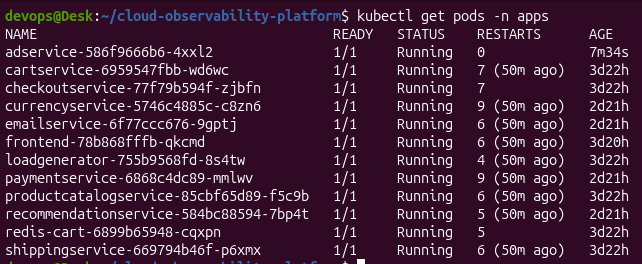
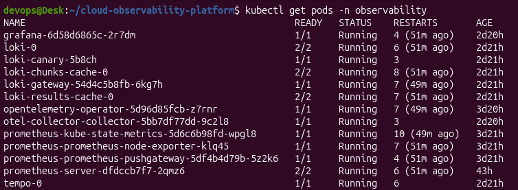
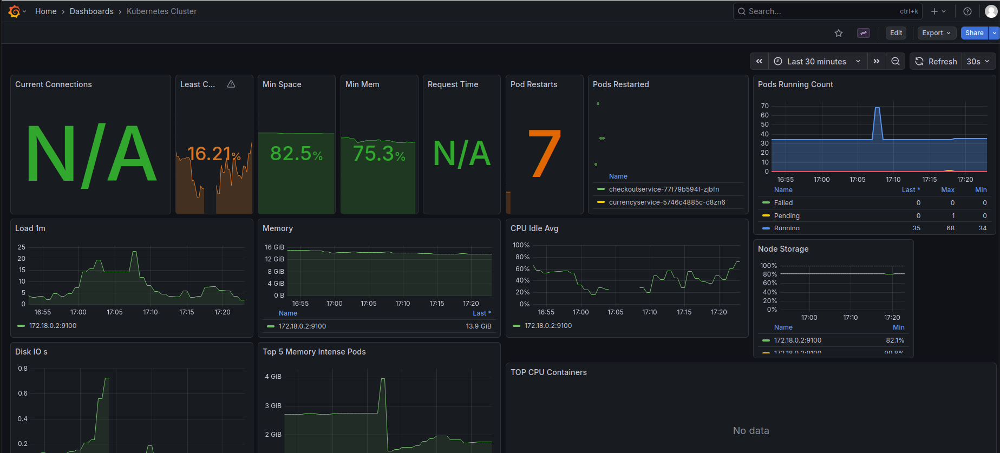
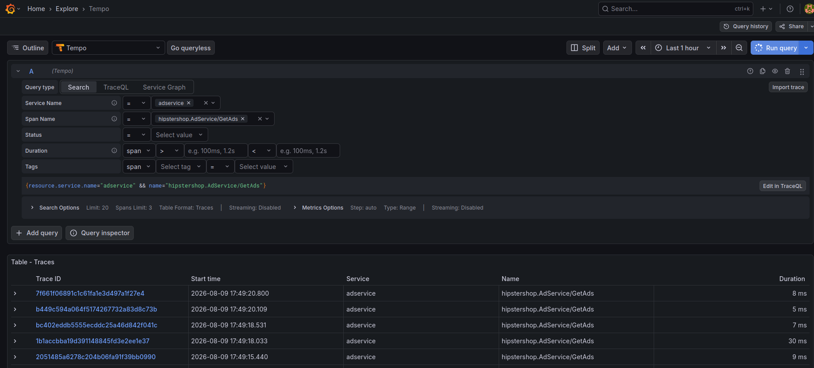
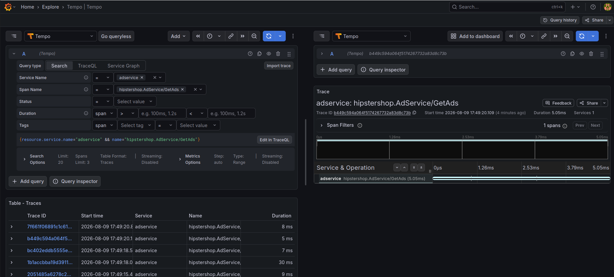

# Cloud Observability Platform

A Kubernetes observability stack (Prometheus, Loki, Tempo, Grafana, OpenTelemetry) deployed on a local `kind` cluster, instrumenting Google's Online Boutique microservices demo.

Built as a hands-on portfolio project to learn the LGTM-style observability stack, OpenTelemetry auto-instrumentation, and the operational problems that only show up once you actually run this stuff, not just read about it.

## Architecture

```
kind cluster (single node)
│
├── namespace: apps
│   ├── frontend (Go)              <- entry point, not yet instrumented
│   ├── checkoutservice (Go)       <- orchestrator, not yet instrumented
│   ├── productcatalogservice (Go)
│   ├── shippingservice (Go)
│   ├── adservice (Java)           <- OTel auto-instrumented
│   ├── cartservice (C#)
│   ├── currencyservice (Node.js)  <- OTel auto-instrumented
│   ├── emailservice (Python)      <- OTel auto-instrumented
│   ├── paymentservice (Node.js)   <- OTel auto-instrumented
│   ├── recommendationservice (Python) <- OTel auto-instrumented
│   ├── redis-cart
│   └── loadgenerator
│
└── namespace: observability
    ├── Prometheus (+ node-exporter, kube-state-metrics)
    ├── Grafana
    ├── Loki (single-binary mode)
    ├── Tempo (single-binary mode)
    ├── OpenTelemetry Operator
    └── OpenTelemetry Collector (OTLP receiver -> Tempo / Loki / Prometheus)
```
## Screenshots

[#screenshots](#screenshots)

**Both namespaces healthy.**




**Grafana, imported Kubernetes Cluster dashboard**, live node CPU, memory, load, and pod restart counts.



**Tempo, trace list for `adservice`.**



**Tempo, trace waterfall for a single call.** Note it reports "1 spans" and "Services 1", this is the honest current state: `adservice` is exporting real spans, but because `frontend` and `checkoutservice` don't yet propagate trace context, each trace stops at one service instead of following the request across the full chain. See Known Limitations above.



## Tech stack

| Layer | Technology | Notes |
|---|---|---|
| Cluster | kind | Single control-plane node |
| IaC | Terraform | Provisions the kind cluster and namespaces |
| App | [Google Online Boutique](https://github.com/GoogleCloudPlatform/microservices-demo) | 10 microservices + Redis + load generator, vendored manifest, Apache-2.0 |
| Metrics | Prometheus, node-exporter, kube-state-metrics | Mimir was scoped out for this environment, see Next Steps |
| Logs | Loki | Single-binary deployment mode |
| Traces | Tempo | Single-binary deployment mode |
| Dashboards | Grafana | Prometheus, Tempo, and Loki wired as datasources |
| Instrumentation | OpenTelemetry Operator + Collector | Auto-instrumentation for Java, Node.js, Python |

## Prerequisites

- Linux host or VM (developed on Ubuntu in VirtualBox)
- Docker
- kubectl
- kind
- Helm
- Terraform

Recommended VM sizing: 20 GB RAM, 4-6 vCPUs. Don't allocate more vCPUs than roughly half your physical core count, hypervisor scheduling overhead gets worse, not better, past that point.

## Quick start

```bash
git clone https://github.com/Vaikunthan28/cloud-observability-platform.git
cd cloud-observability-platform

make cluster    # kind cluster via Terraform
make apps       # Online Boutique + Ingress
make obs        # Prometheus, Grafana, Loki, Tempo, OTel operator + collector

make status         # check pod health across both namespaces
make port-forward   # Grafana at http://localhost:3000 (admin/admin)
```

`admin/admin` is a local-lab credential only. In a real environment this would come from a secrets manager (Vault, External Secrets Operator, sealed-secrets), not a values file.

The frontend needs no extra step to reach because `make apps` also deploys an NGINX Ingress bound to the same host port 80 the kind cluster maps in (see `extraPortMappings` in `terraform/main.tf`), that's a standing route, always live while the cluster's running. Grafana, Prometheus, and Tempo don't have an Ingress in front of them, they're ClusterIP only, so `make port-forward` opens a temporary tunnel straight to one pod instead, and it only lasts as long as that terminal stays open. A real deployment would put an Ingress in front of those too, port-forward here is a lab-only shortcut.

## What each phase deploys

**`make cluster`**: single-node kind cluster with port 80 mapped to the host, `apps` and `observability` namespaces created via Terraform.

**`make apps`**: the 10-service Online Boutique app plus Redis and a load generator, fronted by an NGINX Ingress.

**`make obs`**: Prometheus (metrics), Grafana (dashboards), Loki and Tempo in single-binary mode (logs and traces), the OpenTelemetry Operator, and an OpenTelemetry Collector that receives OTLP and fans it out to Prometheus, Loki, and Tempo.

## Current state and known limitations

Being direct about what's actually working versus what's aspirational, since that matters more than it looks like:

- **Traces are not yet end-to-end.** `adservice`, `currencyservice`, `paymentservice`, `emailservice`, and `recommendationservice` are auto-instrumented via the OTel Operator and are exporting real spans to Tempo. `frontend` and `checkoutservice` are Go, and Go auto-instrumentation in the OTel Operator is eBPF-based and not reliable inside a VM, so it was intentionally skipped. Because those two services never create a span or attach a `traceparent` header, every downstream call currently starts a fresh, disconnected trace rather than one continuous frontend-to-checkout-to-payment trace. The fix doesn't require writing new instrumentation: the upstream Online Boutique source already has native OTel SDK wiring in `frontend` and `checkoutservice`, gated behind two environment variables (`ENABLE_TRACING=1` and `COLLECTOR_SERVICE_ADDR=otel-collector-collector.observability.svc.cluster.local:4317`). Wiring those in is the next task.
- **Some fixes were applied live and are being folded back into IaC.** A number of probe timeout, memory limit, and OTel endpoint corrections were applied directly against the running cluster with `kubectl patch` while debugging. Work is in progress to move all of those into the Kustomize patches and Helm values files so a `terraform destroy` followed by a clean `make cluster && make apps && make obs` reproduces the working state without manual intervention.
- **Sampling is set to 100%** (`AlwaysSample` / `parentbased_traceidratio` at 1.0) for demo visibility. A production setup would use a much lower or tail-based sampling rate to control cost and volume.
- **Mimir was scoped out.** The original plan included Mimir for long-term metric storage; Prometheus alone was used instead to fit the lab's resource budget. Prometheus's local storage is not built for long-term retention or horizontal scale, Mimir (or Thanos/Cortex) is the production answer here.
- **Single node, no HA.** Everything, including the observability stack itself, runs on one control-plane node. Acceptable for a lab, not how this would be run for real.

## Issues hit and fixed along the way

| Issue | Root cause | Fix |
|---|---|---|
| CoreDNS lost cluster DNS after a VM restart | `plugin/kubernetes` failed to re-establish its watch on the API server | Deleted and let the CoreDNS pods recreate |
| Java/Python instrumented pods crash-looped | OTel agent adds real startup overhead; default 1s probe timeout killed pods before they were ready | Increased `initialDelaySeconds`/`timeoutSeconds` on liveness and readiness probes, raised memory limits |
| Loki pod crashed on `mkdir /var/loki: read-only file system` | Persistence was disabled with no writable volume configured | Reinstalled with `singleBinary.persistence.enabled=true` and a PVC (StatefulSets can't have storage fields patched after creation, this needed a clean reinstall) |
| `Instrumentation` CR apply failed with "no matches for kind" | `OpenTelemetryCollector` supports `v1beta1`, but `Instrumentation` is still `v1alpha1` in this Operator version | Used the correct `apiVersion` per resource type |
| Java agent traces never reached the Collector | Endpoint pointed at the gRPC port (4317); the agent's default protocol expected the HTTP port | Pointed the `Instrumentation` exporter endpoint at `:4318` |
| Prometheus crashed with duplicate job name | Overriding `serverFiles.prometheus.yml` collided with a scrape job already defined by the chart | Used `extraScrapeConfigs` (appends) instead of replacing the whole file |
| Namespace mismatch on first app deploy | `kustomization.yaml` didn't pin a namespace, so resources landed in `default` | Added `namespace: apps` to the Kustomization |

## Project structure

```
cloud-observability-platform/
├── terraform/                  # kind cluster + namespace provisioning
├── helm/
│   ├── observability/          # Prometheus, Grafana, OTel Collector/Instrumentation values
│   └── apps/                   # Kustomize patches (probes, resources, OTel annotations)
├── apps/online-boutique/       # Vendored upstream manifest + ingress
├── grafana-dashboards/         # Exported dashboard JSON
├── alerts/                     # Prometheus alerting rules (in progress)
├── docs/screenshots/           # Grafana, Tempo, and cluster screenshots
├── Makefile
└── README.md
```

## Next steps

- Wire `ENABLE_TRACING` and `COLLECTOR_SERVICE_ADDR` into `frontend` and `checkoutservice` for genuinely connected, end-to-end traces
- Fold the live `kubectl patch` fixes back into Kustomize patches and Helm values, then verify a clean rebuild from scratch
- RED (rate, errors, duration) dashboards per service, backed by real PromQL, not just the imported community dashboard
- Prometheus alerting rules with Alertmanager routing, based on SLOs rather than raw resource thresholds
- Network policies (default-deny, tier-based) across the `apps` namespace

## Attribution

The Online Boutique application is [GoogleCloudPlatform/microservices-demo](https://github.com/GoogleCloudPlatform/microservices-demo), Apache License 2.0.
